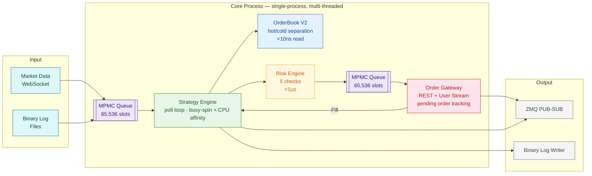
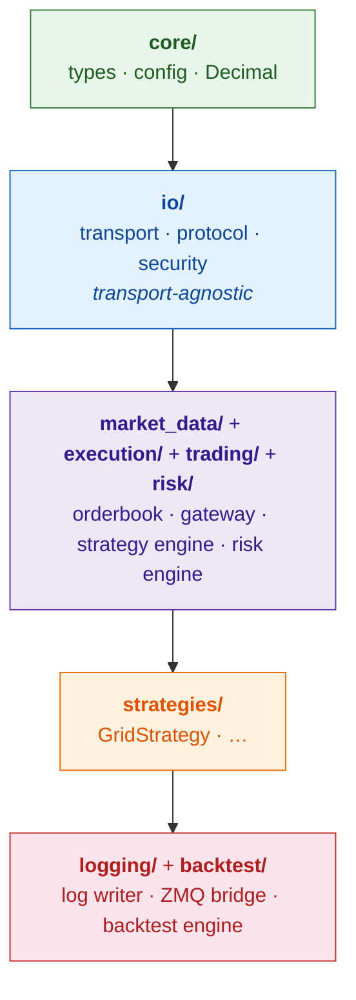

<div align="center">

# ⚡ Chronos Trading Engine

**Ultra-low latency quantitative trading platform — public demo pipeline**

<span style="font-size:1.1em;color:#8b949e">Sub-14μs tick→decision latency · Lock-free C++20 · Fixed-point arithmetic</span>

<br>

[](LICENSE)
[](https://en.cppreference.com/w/cpp/20)
[]()
[]()
[](https://github.com/leafxuzm/libchronos/actions)
[](https://github.com/leafxuzm/libchronos/releases)

</div>

---

<table align="center"><tr>
<td align="center"><b>13.8μs</b><br><sub>E2E latency<br>tick→decision</sub></td>
<td align="center"><b>2.6M/s</b><br><sub>System<br>throughput</sub></td>
<td align="center"><b>6</b><br><sub>Design<br>patterns</sub></td>
<td align="center"><b>368</b><br><sub>Tests<br>45 suites</sub></td>
<td align="center"><b>3</b><br><sub>Platform<br>builds</sub></td>
</tr></table>

---

## Architecture



<div class="callout" style="background:#0d3323;border-left:4px solid #3fb950;padding:0.8rem 1rem;border-radius:0 6px 6px 0;margin:1rem 0;">

**Single-process, multi-threaded.** All core trading runs in one process. Logging and backtesting are separate processes connected via ZeroMQ PUB-SUB. Two MPMC queues decouple market data ingestion, strategy evaluation, and order execution — each stage runs on its own pinned thread.

</div>

### Dependency Layering



<div class="callout" style="background:#0c2d48;border-left:4px solid #58a6ff;padding:0.8rem 1rem;border-radius:0 6px 6px 0;margin:1rem 0;">

**Lower layers never depend on upper layers.** `io/` is transport-agnostic — WebSocket (Binance/OKX), raw TCP (SSE STEP), and UDP multicast (SZSE MDDP) all implement the same `Transport`/`Protocol` interfaces.

</div>

---

## Performance

<p align="center"><i>Apple M1 Max, -O3 -march=native -mtune=native, Clang 17</i></p>

| Component | Operation | Measured | vs Target |
|:----------|:----------|:--------:|:---------:|
| MPMC Queue | push / pop | <50ns | |
| OrderBook V2 | best bid/ask (hot) | <10ns | |
| OrderBook V2 | top 5 levels (hot) | <10ns | |
| OrderBook V2 | full 20 levels (cold) | <50ns | |
| OrderBook V2 | update | <100ns | |
| OrderIDGenerator | `nextID()` | <10ns | |
| RiskEngine | `checkOrder()` | <1μs | |
| StrategyEngine | `onTick()` dispatch | ~3μs | |
| **End-to-end** | **tick → strategy decision** | **13.8μs** | 3.6× below budget |
| **System throughput** | **tick processing** | **>2.6M/s** | 2.6× above target |

<br>

<table>
<tr>
<th>E2E Optimization</th><th>P50 Latency</th><th>Improvement</th>
</tr>
<tr>
<td>Baseline <code>std::this_thread::yield()</code></td>
<td align="center">90–207μs</td><td align="center">—</td>
</tr>
<tr>
<td bgcolor="#0d3323"><b>Busy-spin</b> <code>cpuRelax()</code></td>
<td align="center" bgcolor="#0d3323"><b>13.8μs</b></td>
<td align="center" bgcolor="#0d3323"><b>7.4× faster</b></td>
</tr>
<tr>
<td>Busy-spin + CPU affinity</td>
<td align="center">13.2μs</td>
<td align="center">marginal gain*</td>
</tr>
</table>

<sub>*CPU affinity prevents residual jitter (tail latency). The dominant factor is avoiding OS scheduler invocations. See the [E2E latency optimization report](https://github.com/leafxuzm/trading_engine/blob/main/docs/e2e-latency-optimization.md).</sub>

> E2E measures the full hot path: `pushTick()` → MPMC queue → engine thread pop → strategy `onTick()` → risk check → MPMC queue → gateway thread `popOrder()`. This is the latency-critical path that determines trading decision speed.

---

## Design Patterns

<table>
<tr>
<th width="30%">Pattern</th><th>Description</th>
</tr>
<tr>
<td bgcolor="#0c2d48"><b>🔥 Hot/Cold Data Separation</b></td>
<td bgcolor="#0c2d48">Frequently accessed fields (top 5 price levels) in compact cache-aligned structs; cold data in separate storage. <code>OrderBookV2</code> hot path reads from L1 cache only.</td>
</tr>
<tr>
<td bgcolor="#1c2128"><b>🔒 Optimistic Locking</b> <sub>(Seqlock)</sub></td>
<td bgcolor="#1c2128">Atomic 64-bit version counter. Reader retries if version changed during read. Zero writer-blocking.</td>
</tr>
<tr>
<td bgcolor="#0c2d48"><b>Double Buffering</b> <sub>(RCU-style)</sub></td>
<td bgcolor="#0c2d48">Two data copies; writer updates the dark buffer, then atomic pointer swap makes it visible. No reader locks.</td>
</tr>
<tr>
<td bgcolor="#1c2128"><b>Busy-Spin + CPU Affinity</b></td>
<td bgcolor="#1c2128">Engine and Gateway threads replace <code>yield()</code> with <code>cpuRelax()</code> (inline <code>PAUSE</code>/<code>YIELD</code> instruction). Pinned to dedicated cores via <code>pthread_setaffinity_np</code> / Mach thread affinity to prevent cache migration.</td>
</tr>
<tr>
<td bgcolor="#0c2d48"><b>🔢 Fixed-Point Arithmetic</b></td>
<td bgcolor="#0c2d48">All financial values use <code>Decimal</code> = <code>fpm::fixed&lt;int64_t, __int128, 32&gt;</code> (64-bit, 32 fractional bits). No floating-point rounding errors.</td>
</tr>
<tr>
<td bgcolor="#1c2128"><b>Process Isolation via ZMQ</b></td>
<td bgcolor="#1c2128">Latency-critical core in one process; I/O-heavy logging/backtest in separate processes connected by ZMQ PUB-SUB.</td>
</tr>
</table>

---

## Quick Start

### 📋 Prerequisites

| OS | Command |
|:---|:--------|
| **macOS** | `brew install cmake boost openssl zeromq pkg-config` |
| **Ubuntu** | `sudo apt install cmake build-essential libboost-dev libssl-dev libzmq3-dev pkg-config` |

### 🚀 Clone & Build

```bash
# Clone the project family side-by-side
git clone https://github.com/leafxuzm/libchronos-deps.git
git clone https://github.com/leafxuzm/trading_engine.git

# Build (libchronos-deps fetched automatically; libchronos.a auto-downloaded from release)
cd trading_engine
mkdir build && cd build
cmake .. -DCMAKE_BUILD_TYPE=Release
make -j$(nproc 2>/dev/null || sysctl -n hw.logicalcpu)
```

<div class="callout" style="background:#0d3323;border-left:4px solid #3fb950;padding:0.8rem 1rem;border-radius:0 6px 6px 0;margin:1rem 0;">

<code>FindChronos.cmake</code> searches for <code>libchronos.a</code> in 4 tiers: (1) <code>CHRONOS_LIBRARY</code> env var, (2) bundled <code>lib/</code>, (3) sibling <code>../libchronos</code> source (dev mode), (4) auto-download from GitHub Releases. <b>No manual dependency management needed.</b>

</div>

### ▶️ Run

```bash
# File replay mode (historical data)
./trading_engine --config=../config/example.yaml --replay=./logs --date=20240617

# Live mode — Binance Futures testnet (paper trading, no real money)
export BINANCE_API_KEY="your_testnet_api_key"
export BINANCE_API_SECRET="your_testnet_api_secret"
./trading_engine --config=../config/example.yaml --live --exchange=binance
```

### Configuration

<div class="callout" style="background:#1c2128;border-left:4px solid #bc8cff;padding:0.8rem 1rem;border-radius:0 6px 6px 0;margin:1rem 0;">

CLI flags via <b>gflags</b> · Config file via <b>YAML</b> · Secrets via <b>environment variables</b> (<code>${VAR_NAME}</code> resolved at startup)

</div>

```yaml
engine:
  initial_capital: 100000.0

strategies:
  - name: GridStrategy
    enabled: true
    parameters:
      grid_low: 95.0
      grid_high: 105.0
      grid_levels: 5
      quantity: 0.1
      symbol_ids: [1]

exchanges:
  - name: binance
    websocket_url: "wss://testnet.binance.vision/ws"
    rest_url: "https://testnet.binance.vision"
    api_key: "${BINANCE_API_KEY}"
    api_secret: "${BINANCE_API_SECRET}"
    symbols: ["btcusdt", "ethusdt"]

risk:
  max_order_value: 100000.0
  max_position_value: 500000.0
  max_orders_per_second: 100
  max_total_position_value: 1000000.0
  min_available_capital: 10000.0
  max_drawdown_percent: 20.0
```

---

## Project Family

<p align="center">

| Repository | Visibility | Purpose |
|:-----------|:----------:|:--------|
| [libchronos-deps](https://github.com/leafxuzm/libchronos-deps) | Public | Third-party dependency aggregation (FetchContent) |
| [libchronos](https://github.com/leafxuzm/libchronos) | Public | Core library (`libchronos.a`) — all algorithm implementations |
| [**trading_engine**](https://github.com/leafxuzm/trading_engine) | Public | **Application demo — pipeline orchestration** |

</p>

---

## Design Philosophy

<div class="callout" style="background:#1c2128;border-left:4px solid #d2991d;padding:1rem 1.2rem;border-radius:0 8px 8px 0;margin:1rem 0;">

<p style="font-size:1.05em;margin:0 0 0.8rem 0;"><b>"懂C++ ≠ 懂延迟"</b></p>
<p style="margin:0;color:#8b949e;">Understanding C++ is necessary but not sufficient for low-latency programming. Latency comes from understanding the hardware: cache hierarchy, store buffers, branch predictors, and memory ordering. A technically correct C++ program can still destroy cache locality, trigger false sharing, or stall on unnecessary barriers.</p>

</div>

| # | Principle |
|:-:|:----------|
| 1 | **Measure, don't assume.** Every component has a latency budget and a benchmark. |
| 2 | **Cold data must not pollute hot cache lines.** `alignas(64)` on all shared-memory data structures. |
| 3 | **Lock-free where it matters.** CAS loops over mutexes when contention is low; MPMC queue decouples producer-consumer. |
| 4 | **No allocation on the hot path.** Pre-allocated object pools, fixed-size arrays, no `std::vector` in tick processing. |
| 5 | **Explicit memory ordering.** Every `std::atomic` has an explicit `std::memory_order` — no implicit sequential consistency. |
| 6 | **Never enter the kernel on the hot path.** Busy-spin with `cpuRelax()` — `std::this_thread::yield()` costs 10–100μs in scheduler overhead. |

<br>

<div align="center">

---

<p style="color:#8b949e;font-size:0.85em;">
  Chronos Trading Engine · MIT License · <a href="https://github.com/leafxuzm/trading_engine">GitHub</a>
</p>

</div>
