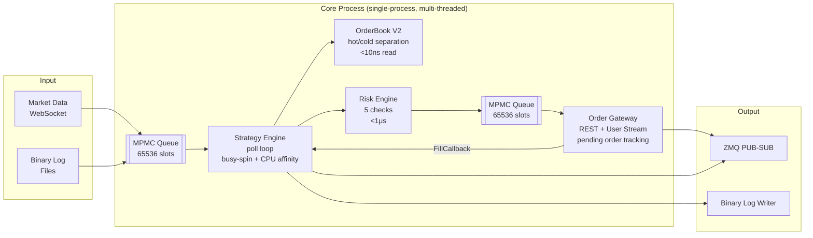

# Chronos Trading Engine

**Ultra-low latency quantitative trading platform** — public demo of the HFT pipeline.

Sub-50μs market-data-to-strategy-decision latency. Lock-free architecture, C++20, fixed-point arithmetic.

[](LICENSE)
[](https://en.cppreference.com/w/cpp/20)
[]()

## Architecture



### Single-process, multi-threaded

All core trading runs in one process. Logging and backtesting are separate processes connected via ZeroMQ PUB-SUB.

### Dependency Layering

```
   core/  (types, config, Decimal)
     ↓
   io/   (transport, protocol, security)  ← transport-agnostic design
     ↓
   market_data/ + execution/ + trading/ + risk/
     ↓
   strategies/  ← GridStrategy, etc.
     ↓
   logging/ + backtest/
```

Lower layers never depend on upper layers. `io/` is transport-agnostic — WebSocket (Binance/OKX), raw TCP (SSE STEP), and UDP multicast (SZSE MDDP) all implement the same Transport/Protocol interfaces.

## Performance

### Benchmarked Results

*Apple M1 Max, -O3 -march=native -mtune=native, Clang 17.*

| Component | Operation | Measured | Target |
|-----------|-----------|----------|--------|
| MPMC Queue | push / pop | <50ns | <50ns |
| OrderBook V2 | best bid/ask (hot) | <10ns | <10ns |
| OrderBook V2 | top 5 levels (hot) | <10ns | <10ns |
| OrderBook V2 | full 20 levels (cold) | <50ns | <50ns |
| OrderBook V2 | update | <100ns | <100ns |
| OrderIDGenerator | nextID() | <10ns | <10ns |
| RiskEngine | checkOrder() | <1μs | <1μs |
| StrategyEngine | onTick() dispatch | ~3μs | <10μs |
| **End-to-end** | **tick → strategy decision** | **13.8μs** | **<50μs** |
| **System throughput** | **tick processing** | **>2.6M/s** | **>1M/s** |

### E2E Latency Evolution

| Optimization | P50 Latency | Improvement |
|-------------|-------------|-------------|
| Baseline (`std::this_thread::yield()`) | 90–207μs | — |
| Busy-spin (`cpuRelax()`) | **13.8μs** | **7.4×** |
| Busy-spin + CPU affinity | 13.2μs | marginal gain* |

*CPU affinity prevents residual jitter (tail latency) but the dominant factor is avoiding OS scheduler invocations via busy-spin. See the [E2E latency optimization report](https://github.com/leafxuzm/trading_engine/blob/main/docs/e2e-latency-optimization.md) for details.

### E2E Measurement

E2E measures the full hot path: `pushTick()` → MPMC queue → engine thread pop → strategy `onTick()` → risk check → MPMC queue → gateway thread `popOrder()`. This is the latency-critical path that determines trading decision speed.

## Design Patterns

### 1. Hot/Cold Data Separation
Frequently accessed fields (top 5 price levels) in compact cache-aligned structs; cold data in separate storage. `OrderBookV2` hot path reads from L1 cache only.

### 2. Lock-Free Optimistic Reads (Seqlock)
Atomic 64-bit version counter. Reader retries if version changed during read. Zero writer-blocking.

### 3. Double Buffering (RCU-style)
Two data copies; writer updates the dark buffer, then atomic pointer swap makes it visible.

### 4. Busy-Spin + CPU Affinity
Engine and Gateway threads replace `std::this_thread::yield()` with `cpuRelax()` (inline `PAUSE`/`YIELD` instruction) to avoid OS scheduler entry. Combined with `pthread_setaffinity_np` / Mach thread affinity to prevent core migration and cache invalidation.

### 5. Fixed-Point Arithmetic
All financial values use `Decimal` = `fpm::fixed<int64_t, __int128, 32>` (64-bit, 32 fractional bits). No floating-point rounding.

### 6. Process Isolation via ZMQ
Latency-critical core in one process; I/O-heavy logging/backtest in separate processes connected by ZMQ PUB-SUB.

## Quick Start

### Prerequisites (macOS)

```bash
brew install cmake boost openssl zeromq pkg-config
```

### Clone & Build

```bash
# Clone the project family side-by-side
git clone https://github.com/leafxuzm/libchronos-deps.git
git clone https://github.com/leafxuzm/trading_engine.git
# libchronos is a private repo — contact for access

# Build (libchronos-deps and libchronos are pulled in via CMake add_subdirectory)
cd trading_engine
mkdir build && cd build
cmake .. -DCMAKE_BUILD_TYPE=Release
make -j4
```

### Run

```bash
# File replay mode (historical data)
./trading_engine --config=../config/example.yaml --replay=./logs --date=20240617

# Live mode — Binance Futures testnet (paper trading, no real money)
export BINANCE_API_KEY="your_testnet_api_key"
export BINANCE_API_SECRET="your_testnet_api_secret"
./trading_engine --config=../config/example.yaml --live --exchange=binance
```

### Configuration

All configuration is in YAML. CLI flags are handled by gflags. Environment variables in `${VAR_NAME}` syntax are resolved at startup.

```yaml
# config/example.yaml
engine:
  initial_capital: 100000.0

strategies:
  - name: GridStrategy
    enabled: true
    parameters:
      grid_low: 95.0
      grid_high: 105.0
      grid_levels: 5
      quantity: 0.1
      symbol_ids: [1]

exchanges:
  - name: binance
    websocket_url: "wss://testnet.binance.vision/ws"
    rest_url: "https://testnet.binance.vision"
    api_key: "${BINANCE_API_KEY}"       # resolved from environment
    api_secret: "${BINANCE_API_SECRET}"
    symbols: ["btcusdt", "ethusdt"]

risk:
  max_order_value: 100000.0
  max_position_value: 500000.0
  max_orders_per_second: 100
  max_total_position_value: 1000000.0
  min_available_capital: 10000.0
  max_drawdown_percent: 20.0
```

## Project Family

| Repository | Visibility | Purpose |
|------------|------------|---------|
| [libchronos-deps](https://github.com/leafxuzm/libchronos-deps) | Public | Third-party dependency aggregation (FetchContent) |
| libchronos | Private | Core library (`libchronos.a`) — all algorithm implementations |
| [trading_engine](https://github.com/leafxuzm/trading_engine) | Public | Application demo — pipeline orchestration |

## Design Philosophy

> **"懂C++ ≠ 懂延迟"** — understanding C++ is necessary but not sufficient for low-latency programming. Latency comes from understanding the hardware: cache hierarchy, store buffers, branch predictors, and memory ordering. A technically correct C++ program can still destroy cache locality, trigger false sharing, or stall on unnecessary barriers.

Key principles:

1. **Measure, don't assume.** Every component has a latency budget and a benchmark.
2. **Cold data must not pollute hot cache lines.** `alignas(64)` on all shared-memory data structures.
3. **Lock-free where it matters.** CAS loops over mutexes when contention is low; MPMC queue for producer-consumer decoupling.
4. **No allocation on the hot path.** Pre-allocated object pools, fixed-size arrays, no `std::vector` in tick processing.
5. **Explicit memory ordering.** Every `std::atomic` has an explicit `std::memory_order` — no implicit sequential consistency.
6. **Never enter the kernel on the hot path.** Busy-spin with `cpuRelax()` — `std::this_thread::yield()` costs 10–100μs in OS scheduler overhead.

## License

MIT — see [LICENSE](LICENSE).
